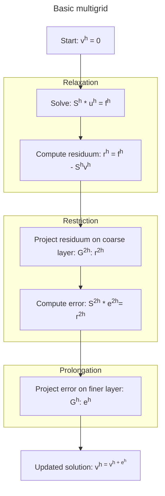

# MGNet  

<div style="text-align:center">


</div>

MultiGrid Methods + Neural Networks = MgNet  

## tl;dr  
MultiGrid methods cool. Repository implements [paper][2] with pytorch.

## Usage

```python
from mgnet.model import mgnet, MGNet
import torch

supported_smoothers = MGNet.supported_smoothers()
print(f'{supported_smoothers=}')
n_image_chan = 3
batch_size = 1
image_width = 28
image_height = 28
model = mgnet(smoother=supported_smoothers[0],
              pretrained=False,
              progress=False,
              in_channels=n_image_chan,
              n_chan_u=128,
              n_chan_f=128,
              n_classes=10,
              n_iter=[2,2,2,2]
              )
x = torch.rand((batch_size, n_image_chan, image_width, image_height))
y = model(x)
print(f'{y=}')
```

## Background  

I first came up with the idea of using multigrid methods in deep learning 
after attending the seminar algebraic multigrid, in which we studied the 
[publication](https://arxiv.org/abs/1611.01917?context=math) by Jinchao Xu 
and Ludmil Zikatanov. 
> If multigrid methods are one of the fastest solvers 
for partial differential equality problems by use of grids, then knowing that
 images are functions on grids, multigrid methods can be used in machine 
learning, especially in FNNs and CNNs ...

i thought. Unfortunately, Sir Xu 
beat me up to the idea and published a [paper][2] 2 years before.  

As I couldn't find a ready-to-use implementation of the paper, the work in this 
repository came to be.  


## Theory of operation  
This type of network generalizes multiple preexisting models like the famous ResNet 
and DenseNet into a single configurable system.

The premise is built upon the idea of multigrid: the solution `u` is smoothened and 
its errors are projected on layers of various sizes.

A single step consists of three phases:
1. **Relaxation:** Given a smooth `S`, the solution of the problem `u` is computed
using `S(u) = f` several time, to obtain an improved solution `v`.
The residuum of the equation is computed `r = f - S(v)`
2. **Restriction:** the residuum `r` is transferred on a layer of lower size and the
approximation of the error `A_{r}e_{r} = r` is computed
3. **Prolongation or interpolation**: the error `e` is projected back on the original
layer `A_{p}e_{r} = r_{p}` and the original solution updated: `v = v + e_{r}`




## Testing
**Local:**  
Install dependencies:
```shell
uv sync --dev
```
Run inference test (default values already set. Use `--help` option for help):  
```shell
PYTHONPATH="${PYTHONPATH}:${PWD}" uv run tests/test_inference.py
```
**Docker:**  
Build image:
```shell
docker build . -t mgnet
```  
Run image in container:
```shell
docker run mgnet --help
```

## Literatur
- "[Algebraic Multigrid Methods][1]", Jinchao Xu, Ludmil T Zikatanov
- "[MgNet: A Unified Framework of Multigrid and Convolutional Neural Network][2]", Juncai He, Jinchao Xu
- "[Iterative Solution of Large Sparse Systems of Equations][3]", Wolfgang Hackbusch


[1]: https://arxiv.org/abs/1611.01917?context=math
[2]: http://arxiv.org/abs/1901.10415
[3]: https://link.springer.com/book/10.1007/978-3-319-28483-5
