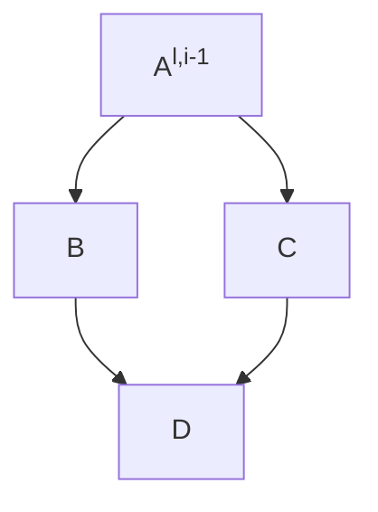

# MGNet  
MultiGrid Methods + Neural Networks = MgNet  

## tl;dr  
MultiGrid methods cool. Repository implements [paper][2] with pytorch.

## Background  

I first came up with the idea of using multigrid methods in deep learning 
after attending the seminar algebraic multigrid, in which we studied the 
[publication](https://arxiv.org/abs/1611.01917?context=math) by Jinchao Xu 
and Ludmil Zikatanov. 
> If multigrid methods are one of the fastest solvers 
for partial differential equality problems by use of grids, then knowing that
 images are functions on grids, multigrid methods can be used in machine 
learning, especially in FNNs and CNNs ...

i thought. Unfortunately, Sir Xu 
beat me up to the idea and published a [paper][2] 2 years before.  

As I couldn't find a ready-to-use implementation of the paper, the work in this 
repository came to be.  


## Theory of operation  



## Building and Running  
**Local:**  
Install dependencies:
```shell
uv sync
```
Run inference test (default values already set. Use `--help` option for help):  
```shell
PYTHONPATH="${PYTHONPATH}:${PWD}" uv run tests/test_inference.py
```
**Docker:**  
Build image:
```shell
docker build . -t mgnet
```  
Run image:
```shell
docker run mgnet --help
```

## Literatur
- "[Algebraic Multigrid Methods][1]", Jinchao Xu, Ludmil T Zikatanov
- "[MgNet: A Unified Framework of Multigrid and Convolutional Neural Network][2]", Juncai He, Jinchao Xu


[1]: https://arxiv.org/abs/1611.01917?context=math
[2]: http://arxiv.org/abs/1901.10415
